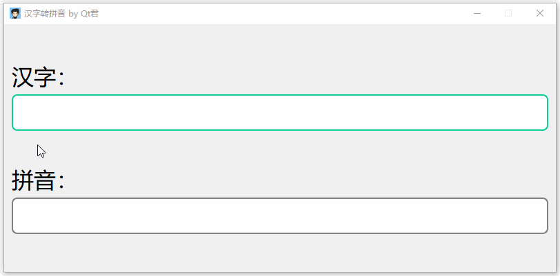

# Hanzi2Pinyin

## 文章介绍
[发布 | 汉字转拼音工具](https://mp.weixin.qq.com/s?src=11&timestamp=1578753129&ver=2090&signature=9zGwkY1qk7pQMV-xbgxp*IMUXM63pCVya-6oml-Z2GUStXe1ibimzQB3Q*qSz4k-1JocHS--9lILyMJTuUS4mTPtO2Uhpj4s4kO5wMfLejvfv1nblm7eKyDsPE-Ou9yP&new=1)

## 汉字拼音源
* version: 0.8.1
* source: https://github.com/mozillazg/pinyin-data
